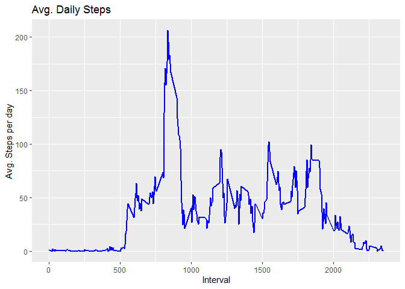

## R Markdown

## Loading the data file

Unzip data to obtain a csv file.

``` r
library("data.table")
library(ggplot2)

download_URL<- "https://d396qusza40orc.cloudfront.net/repdata%2Fdata%2Factivity.zip"
download.file(download_URL, destfile = paste0(getwd(), '/repdata%2Fdata%2Factivity.zip'))
unzip("repdata%2Fdata%2Factivity.zip",exdir = "Data")
```

## 1\. Code for reading in the dataset and/or processing the data

``` r
activityDT <- data.table::fread(input = "data/activity.csv")
```

## 2\. Histogram of the total number of steps taken each day

``` r
Total_Steps <- activityDT[, c(lapply(.SD, sum, na.rm = FALSE)), .SDcols = c("steps"), by = .(date)] 
ggplot(Total_Steps, aes(x = steps)) +
    geom_histogram(fill = "yellow", binwidth = 1000) +
    labs(title = "Daily Steps", x = "Steps", y = "Frequency")
```

    ## Warning: Removed 8 rows containing non-finite values (stat_bin).

<!-- -->

## 3\. Mean and median number of steps taken each day

``` r
Total_Steps[, .(Mean_Steps = mean(steps, na.rm = TRUE), Median_Steps = median(steps, na.rm = TRUE))]
```

    ##    Mean_Steps Median_Steps
    ## 1:   10766.19        10765

## 4\. Time series plot of the average number of steps taken

``` r
IntervalDT <- activityDT[, c(lapply(.SD, mean, na.rm = TRUE)), .SDcols = c("steps"), by = .(interval)] 
ggplot(IntervalDT, aes(x = interval , y = steps)) + geom_line(color="blue", size=1) + labs(title = "Avg. Daily Steps", x = "Interval", y = "Avg. Steps per day")
```

<!-- -->

## 5\. The 5-minute interval that, on average, contains the maximum number of steps

``` r
IntervalDT[steps == max(steps), .(max_interval = interval)]
```

    ##    max_interval
    ## 1:          835

## 6\. Code to describe and show a strategy for imputing missing data

``` r
activityDT[is.na(steps), .N ]
```

    ## [1] 2304

``` r
activityDT[is.na(steps), "steps"] <- activityDT[, c(lapply(.SD, mean, na.rm = TRUE)), .SDcols = c("steps")]
```

    ## Warning in `[<-.data.table`(`*tmp*`, is.na(steps), "steps", value =
    ## structure(list(: Coerced double RHS to integer to match the type of the
    ## target column (column 1 named 'steps'). One or more RHS values contain
    ## fractions which have been lost; e.g. item 1 with value 37.382600 has been
    ## truncated to 37.

## 7\. Histogram of the total number of steps taken each day after missing values are imputed

``` r
Total_Steps <- activityDT[, c(lapply(.SD, sum)), .SDcols = c("steps"), by = .(date)] 
ggplot(Total_Steps, aes(x = steps)) +
    geom_histogram(fill = "red", binwidth = 1000) +
    labs(title = "Daily Steps", x = "Steps", y = "Frequency")
```

<!-- -->

## 8\. Panel plot comparing the average number of steps taken per 5-minute interval across weekdays and weekends

``` r
# Just recreating activityDT from scratch then making the new factor variable. (No need to, just want to be clear on what the entire process is.) 
activityDT <- data.table::fread(input = "data/activity.csv")
activityDT[, date := as.POSIXct(date, format = "%Y-%m-%d")]
activityDT[, `Day of Week`:= weekdays(x = date)]
activityDT[grepl(pattern = "Monday|Tuesday|Wednesday|Thursday|Friday", x = `Day of Week`), "weekday or weekend"] <- "weekday"
activityDT[grepl(pattern = "Saturday|Sunday", x = `Day of Week`), "weekday or weekend"] <- "weekend"
activityDT[, `weekday or weekend` := as.factor(`weekday or weekend`)]

activityDT[is.na(steps), "steps"] <- activityDT[, c(lapply(.SD, median, na.rm = TRUE)), .SDcols = c("steps")]
IntervalDT <- activityDT[, c(lapply(.SD, mean, na.rm = TRUE)), .SDcols = c("steps"), by = .(interval, `weekday or weekend`)] 
ggplot(IntervalDT , aes(x = interval , y = steps, color=`weekday or weekend`)) + geom_line() + labs(title = "Avg. Daily Steps by Weektype", x = "Interval", y = "No. of Steps") + facet_wrap(~`weekday or weekend` , ncol = 1, nrow=2)
```

<!-- -->
